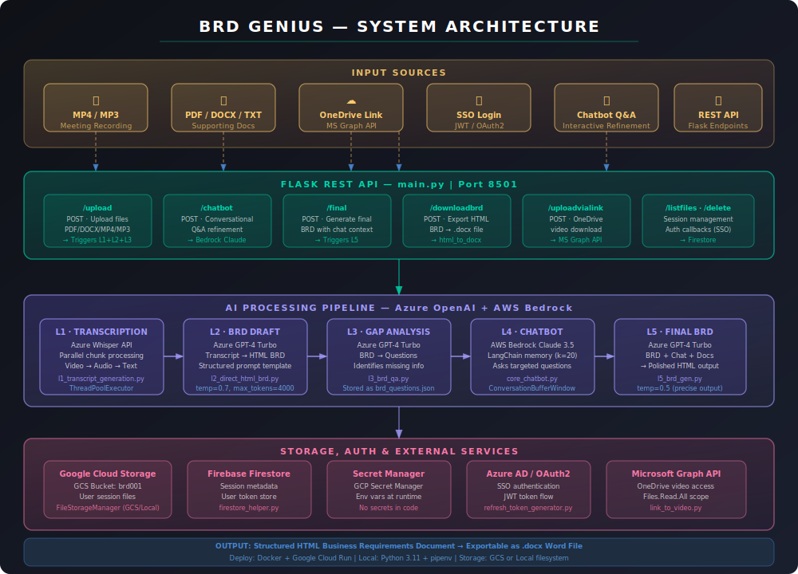

<div align="center">

# 🧠 BRD Genius

### *Turn any meeting recording or document into a professional Business Requirements Document — in minutes.*

[](https://python.org)
[](https://flask.palletsprojects.com)
[](https://azure.microsoft.com/en-us/products/ai-services/openai-service)
[](https://aws.amazon.com/bedrock/)
[](https://cloud.google.com)
[](https://docker.com)
[](LICENSE)

<br/>

> **Upload a meeting video, audio, or document → get a structured, AI-generated BRD in HTML & DOCX format.**  
> Powered by a 5-layer AI pipeline combining Azure OpenAI, AWS Bedrock Claude, and LangChain.

<br/>

<!--
  📸 SCREENSHOT PLACEHOLDER
  Replace the block below with an actual screenshot once deployed.
  Recommended: 1280×720 or 16:9 ratio, showing the API in action via Postman or a frontend UI.

  
-->

> 🖼️ *[Screenshot: API workflow — upload → transcribe → generate → export]*  
> *See the [Screenshots & Recordings](#-screenshots--demo) section for capture instructions.*

</div>

---

## 📖 Table of Contents

- [What It Does](#-what-it-does)
- [Architecture](#-architecture)
- [5-Layer AI Pipeline](#-5-layer-ai-pipeline)
- [API Endpoints](#-api-endpoints)
- [Project Structure](#-project-structure)
- [Getting Started](#-getting-started)
- [Configuration](#-configuration)
- [Deployment](#-deployment)
- [Screenshots & Demo](#-screenshots--demo)
- [Tech Stack](#-tech-stack)
- [Roadmap](#-roadmap)

---

## 🚀 What It Does

**BRD Genius** is a production-ready REST API that automates the creation of Business Requirements Documents from raw, unstructured inputs. It bridges the gap between a business meeting and a formal, structured BRD — a task that traditionally takes hours of manual analyst work.

**Core capabilities:**

| Input | Processing | Output |
|-------|-----------|--------|
| 🎥 MP4 / MP3 meeting recordings | Parallel audio transcription (Azure Whisper) | 📄 Structured HTML BRD |
| 📄 PDF, DOCX, TXT documents | LLM-powered extraction & analysis | 📝 Downloadable .docx Word file |
| 🔗 OneDrive meeting links | MS Graph API video download | 💬 Gap analysis Q&A |
| 💬 Chatbot Q&A answers | Conversational BRD refinement | ✅ Production-ready document |

**What makes it different:**
- **Multi-modal input** — handles video, audio, documents, and cloud links in one pipeline
- **Iterative refinement** — a smart chatbot asks targeted follow-up questions based on BRD gaps
- **Enterprise-ready** — SSO/JWT auth, GCS storage, Firestore metadata, Secret Manager for zero-secrets-in-code
- **Dual AI providers** — Azure OpenAI (GPT-4) for generation, AWS Bedrock Claude 3.5 for conversational Q&A

---

## 🏗️ Architecture

The system is organized into four distinct layers that process input end-to-end:



> The diagram above shows data flow from raw inputs (top) → Flask REST API → AI Pipeline → Cloud Storage & Auth services → final BRD output.

---

## 🔬 5-Layer AI Pipeline

The heart of BRD Genius is a sequential, multi-LLM pipeline:

```
Input Files / Meeting Video
        │
        ▼
┌───────────────────────────────────────────────────────┐
│  L1 · TRANSCRIPTION  (Azure Whisper)                  │
│  Video → Audio → Parallel chunks → Full transcript    │
│  ThreadPoolExecutor with configurable workers         │
└─────────────────────┬─────────────────────────────────┘
                      │
                      ▼
┌───────────────────────────────────────────────────────┐
│  L2 · BRD DRAFT  (Azure GPT-4 Turbo)                 │
│  Transcript + Docs → Structured HTML BRD              │
│  Prompt: business analyst persona, strict HTML output │
└─────────────────────┬─────────────────────────────────┘
                      │
                      ▼
┌───────────────────────────────────────────────────────┐
│  L3 · GAP ANALYSIS  (Azure GPT-4 Turbo)              │
│  BRD → JSON list of targeted clarifying questions     │
│  Identifies missing requirements, ambiguous sections  │
└─────────────────────┬─────────────────────────────────┘
                      │
                      ▼
┌───────────────────────────────────────────────────────┐
│  L4 · INTERACTIVE CHATBOT  (AWS Bedrock Claude 3.5)  │
│  Asks the user gap-filling questions conversationally │
│  LangChain ConversationBufferWindowMemory (k=20)      │
│  Persists Q&A to chatbot.json for L5 context         │
└─────────────────────┬─────────────────────────────────┘
                      │
                      ▼
┌───────────────────────────────────────────────────────┐
│  L5 · FINAL BRD SYNTHESIS  (Azure GPT-4 Turbo)       │
│  Original BRD + Chat history + Additional docs        │
│  → Refined, comprehensive, production-ready BRD       │
│  Exported as HTML → Converted to .docx on download   │
└───────────────────────────────────────────────────────┘
```

---

## 🔌 API Endpoints

Base URL: `http://localhost:8501/brdfrdgeneration`

| Method | Endpoint | Description |
|--------|----------|-------------|
| `GET` | `/brdfrdgeneration` | Health check |
| `POST` | `/upload` | Upload files (PDF/DOCX/TXT/MP4/MP3) → triggers L1+L2+L3 |
| `POST` | `/chatbot` | Send/receive chatbot messages (L4) |
| `POST` | `/final` | Generate final polished BRD (L5) |
| `POST` | `/downloadbrd` | Export BRD as .docx Word file |
| `POST` | `/uploadvialink` | Download & process OneDrive meeting recording |
| `POST` | `/uploadinbetween` | Add more files mid-session |
| `GET` | `/listfiles` | List all sessions for a user |
| `POST` | `/delete` | Delete a session and all associated files |
| `GET` | `/authsuccesslogin` | SSO callback — issues JWT, redirects |
| `GET` | `/auth/callback` | OAuth2 callback — exchanges auth code for token |

### Example: Upload & Generate

```bash
# 1. Upload a meeting recording
curl -X POST http://localhost:8501/brdfrdgeneration/upload \
  -F "userId=user123" \
  -F "files=@meeting.mp4"

# Response:
# { "html": "<h1>Business Requirements...</h1>", "unique_id": "abc-123" }

# 2. Start chatbot to refine the BRD
curl -X POST http://localhost:8501/brdfrdgeneration/chatbot \
  -H "Content-Type: application/json" \
  -d '{"userId":"user123","uniqueId":"abc-123","file_name":"meeting","question":"hi"}'

# 3. Generate final polished BRD
curl -X POST http://localhost:8501/brdfrdgeneration/final \
  -H "Content-Type: application/json" \
  -d '{"userId":"user123","uniqueId":"abc-123"}'

# 4. Download as Word document
curl -X POST http://localhost:8501/brdfrdgeneration/downloadbrd \
  -F "userId=user123" \
  -F "uniqueId=abc-123" \
  -F "filename=project_brd" \
  -F "htmlcontent=<html>..." \
  --output project_brd.docx
```

---

## 📁 Project Structure

```
brd-genius/
│
├── main.py                        # Flask app, all API routes, JWT auth
├── processing.py                  # Orchestrates the full pipeline
├── config.py                      # All configuration constants
├── requirements.txt               # Python dependencies
├── .env.example                   # Environment variable template
├── .gitignore
│
├── app_files/
│   ├── api/                       # AI pipeline layers
│   │   ├── l1_transcpit_generation.py   # L1: Video → Transcript (Azure Whisper)
│   │   ├── l2_direct_html_brd.py        # L2: Transcript → HTML BRD (GPT-4)
│   │   ├── l3_brd_qa.py                 # L3: BRD → Gap questions (GPT-4)
│   │   └── l5_brd_gen.py                # L5: Final BRD synthesis (GPT-4)
│   │
│   ├── chatbot/                   # L4: Conversational refinement engine
│   │   ├── core_chatbot.py        # LangChain chatbot with memory
│   │   ├── chatbot_api.py         # Session management & API interface
│   │   ├── file_manager.py        # Dual-mode storage (Local / GCS)
│   │   ├── data_loader.py         # BRD questions & prompt loaders
│   │   ├── model_loader.py        # AWS Bedrock model initializer
│   │   ├── memory_manager.py      # Chat history persistence
│   │   └── prompt_builder.py      # LangChain prompt construction
│   │
│   ├── services/                  # External integrations
│   │   ├── firestore_helper.py    # Firebase Firestore CRUD operations
│   │   ├── html_to_docx.py        # HTML → Word document converter
│   │   ├── link_to_video.py       # OneDrive download via MS Graph API
│   │   └── refresh_token_generator.py  # OAuth2 token management
│   │
│   ├── prompts/                   # System prompts for each LLM call
│   │   └── l2_transcript_analysis_prompt.md
│   │
│   ├── templates/                 # Document templates
│   │   └── brd-template.md        # BRD structure template
│   │
│   └── middleware/                # Per-user session file storage (gitignored)
│       └── {user_id}/{session_id}/
│           ├── l1_transcript.txt
│           ├── brd.html
│           ├── brd_questions.json
│           └── chatbot.json
│
├── docs/
│   ├── architecture.svg           # System architecture diagram
│   └── screenshots/               # Demo screenshots & recordings
│
└── Generate_links.py              # Utility: PDF → GCS URL mapping
```

---

## ⚡ Getting Started

### Prerequisites

- Python 3.11+
- `pipenv` or `pip`
- Docker (recommended for deployment)
- Active accounts: Azure OpenAI, AWS Bedrock, Google Cloud (GCS + Firestore)

### Local Setup (Storage Mode: `local`)

```bash
# 1. Clone the repo
git clone https://github.com/yourusername/brd-genius.git
cd brd-genius

# 2. Install dependencies
pip install -r requirements.txt

# 3. Configure environment
cp .env.example .env
# Edit .env with your API keys

# 4. Set storage mode to local in config.py
# storage_type = 'local'

# 5. Run the server
python main.py
# → API running at http://localhost:8501
```

### Docker Setup (Recommended)

```bash
# Build image
docker build -t brd-genius .

# Run container
docker run -d \
  -p 8501:8501 \
  --env-file .env \
  brd-genius

# API available at http://localhost:8501
```

---

## ⚙️ Configuration

All configuration lives in `config.py`. Key settings:

| Variable | Default | Description |
|----------|---------|-------------|
| `port` | `8501` | Flask server port |
| `storage_type` | `'gcs'` | `'gcs'` for cloud, `'local'` for development |
| `chunk_size` | `15` | Audio chunk duration (minutes) for transcription |
| `chunk_thread` | `8` | Parallel transcription workers |
| `chatbot_model` | `claude-3-5-sonnet` | AWS Bedrock model for chatbot |
| `gcs_bucket_name` | `'brd001'` | GCS bucket for file storage |
| `firestore_db` | `'BRD_db'` | Firestore database ID |

**Required environment variables** (see `.env.example`):

```bash
# Azure OpenAI
AZURE_OPENAI_API_KEY=...
AZURE_OPENAI_ENDPOINT=...
AZURE_OPENAI_DEPLOYMENT=...
AZURE_OPENAI_SPEECH_DEPLOYMENT=...

# AWS Bedrock (for chatbot)
AWS_ACCESS_KEY_ID=...
AWS_SECRET_ACCESS_KEY=...
AWS_DEFAULT_REGION=us-east-1

# Microsoft Azure AD (for OneDrive)
AZURE_BOT_CLIENT_ID=...
AZURE_BOT_CLIENT_SECRET=...
AZURE_BOT_TENANT_ID=...
```

---

## 🚢 Deployment

### Google Cloud Run (Recommended)

This project is designed for Google Cloud Run with GCS and Firestore:

```bash
# Build and push image to GCR
gcloud builds submit --tag gcr.io/YOUR_PROJECT/brd-genius

# Deploy to Cloud Run
gcloud run deploy brd-genius \
  --image gcr.io/YOUR_PROJECT/brd-genius \
  --platform managed \
  --region asia-south1 \
  --allow-unauthenticated \
  --port 8501 \
  --memory 2Gi \
  --set-secrets="ENV_CONFIG=gpt-endpoints:4"
```

Secrets are loaded from **GCP Secret Manager** at runtime — no credentials in the container image.

### Environment Modes

| Mode | Storage | Auth | Use Case |
|------|---------|------|----------|
| `local` | Local filesystem | `.env` file | Development & testing |
| `gcs` | Google Cloud Storage | GCP Secret Manager | Production on Cloud Run |

---

## 📸 Screenshots & Demo

> **For portfolio showcasing** — here's exactly what to capture:

### Screenshots to Take

| # | What to capture | Tool | File name |
|---|----------------|------|-----------|
| 1 | Postman: `/upload` request with MP4 + JSON response | Postman | `upload-request.png` |
| 2 | Generated HTML BRD rendered in browser | Browser | `brd-output.png` |
| 3 | Chatbot conversation showing gap-filling Q&A | Postman / UI | `chatbot-qa.png` |
| 4 | Downloaded `.docx` BRD open in Word | Word | `brd-docx.png` |
| 5 | GCS bucket showing session files | GCP Console | `gcs-storage.png` |
| 6 | Firestore document structure | Firebase Console | `firestore-data.png` |

Place screenshots in `docs/screenshots/` and update the links below:

<!--


-->

### Screen Recording (for GitHub README GIF)

Record a 60-90 second walkthrough:
1. **0:00–0:15** — POST `/upload` with a sample meeting recording
2. **0:15–0:35** — Show the generated HTML BRD in browser
3. **0:35–0:55** — Chat interaction (2-3 Q&A rounds)
4. **0:55–1:10** — POST `/final`, download `.docx`, open in Word

**Tools:** [Loom](https://loom.com) (free) for screen recording → convert to GIF with [Ezgif](https://ezgif.com).

<!--

-->

---

## 🛠️ Tech Stack

| Layer | Technology | Purpose |
|-------|-----------|---------|
| **API Framework** | Flask 3.0 + flask-cors | REST API, routing, streaming responses |
| **LLM (Generation)** | Azure OpenAI GPT-4 Turbo | BRD drafting, gap analysis, final synthesis |
| **LLM (Chatbot)** | AWS Bedrock Claude 3.5 Sonnet | Conversational requirement elicitation |
| **LLM Orchestration** | LangChain | Memory management, prompt chaining |
| **Transcription** | Azure Whisper API | MP4/MP3 → text, parallel chunk processing |
| **Cloud Storage** | Google Cloud Storage | User session file storage |
| **Database** | Firebase Firestore | Session metadata & user token management |
| **Secret Management** | GCP Secret Manager | Zero-secrets-in-code architecture |
| **Auth** | JWT + Azure AD OAuth2 | SSO authentication, token refresh |
| **External API** | Microsoft Graph API | OneDrive file access |
| **Document Export** | python-docx + html2text | HTML BRD → Word .docx |
| **Containerization** | Docker | Portable deployment |
| **Deployment** | Google Cloud Run | Serverless, auto-scaling |

---

## 🗺️ Roadmap

- [ ] Streamlit or React frontend for non-technical users
- [ ] Support for Google Meet & Zoom recordings via native integrations
- [ ] PDF/DOCX template customization per organization
- [ ] FRD (Functional Requirements Document) generation — L5 extended mode
- [ ] Multi-language BRD generation
- [ ] Webhook support for async processing of large video files
- [ ] Rate limiting and usage analytics dashboard

---

## 🤝 Contributing

Contributions are welcome! Please open an issue first to discuss what you'd like to change.

```bash
# Fork → Clone → Create branch
git checkout -b feature/your-feature-name

# Make changes, then:
git commit -m "feat: describe your change"
git push origin feature/your-feature-name
# Open a Pull Request
```

---

## 📄 License

MIT License — see [LICENSE](LICENSE) for details.

---

<div align="center">

**Built with 🤖 multi-LLM pipelines and ☁️ cloud-native architecture**

*If this project helped you, consider giving it a ⭐ — it means a lot!*

</div>
